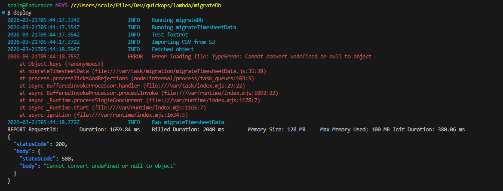

A fast CI/CD tool for uploading, invoking, and logging lambdas - without having to wait on GitHub Actions. Intended for testing which would be small enough to be a pain for git commits/pushes.

## Global Usage
- Put the deploy file somewhere permanent. The file is a bash shell script but **leave it without any extension** (ex: `"C:\Users\scale\Files\Dev\deploy\deploy"`)
- Add the deploy file to path by running this in a Bash terminal (substituting your path): `echo 'export PATH="$PATH:/c/Users/scale/Files/Dev/deploy"' >> ~/.bashrc`
- Reload your terminal: `source ~/.bashrc`
- Run it: `deploy`

## Portable Usage (not recommended)
- Save the deploy file as a `.sh` file type (ex: `deploy.sh`)
- Put it in the root folder of the lambda
- Run it in a Bash terminal (ex: `./deploy.sh`)

## Code Notes
- It gets the `FUNCTION_NAME` from the name of the parent folder
- `export MSYS_NO_PATHCONV=1` and `unset MSYS_NO_PATHCONV` are there because at one point this shell script erroneously sent the entire path to the parent folder rather than just the parent folder name, however that may be vestigial as it may only be an issue with using aws logs (which this script no longer uses)
- It uses awk for all the colouring and also for removing some useless verbosity (such as the time being printed twice every line)

# Licence
This repo is licensed with AGPL3.0, a copyleft license.  
This licence ensures that this remains open source regardless of modifications or through being provided via a SaaS.  
Additionally, the software is provided "as is" with no warranty, and the authors or contributors are not liable for any damages arising from its use.  
All details are in the LICENSE file.